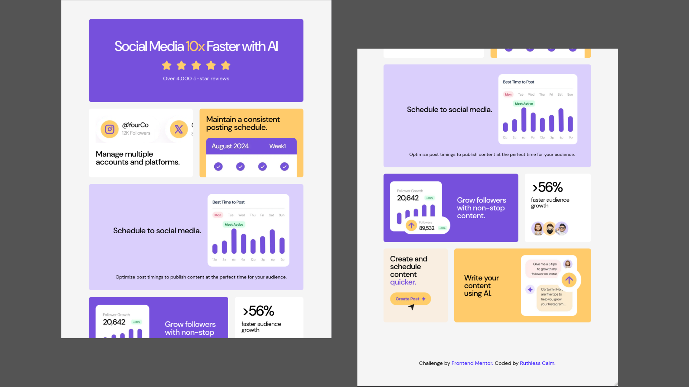
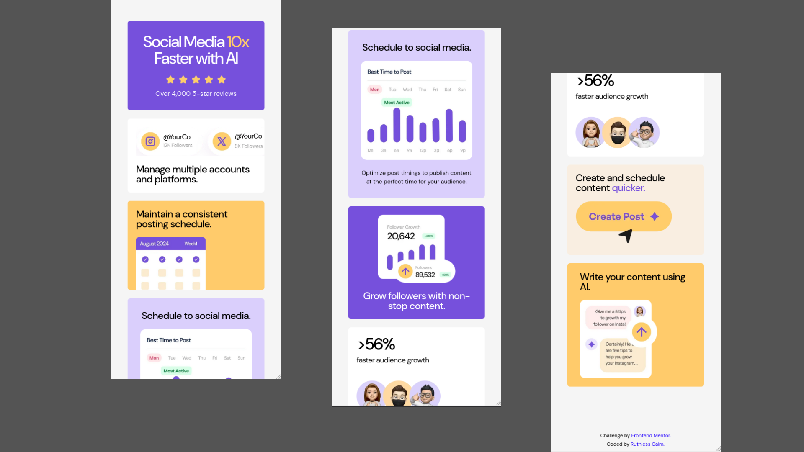
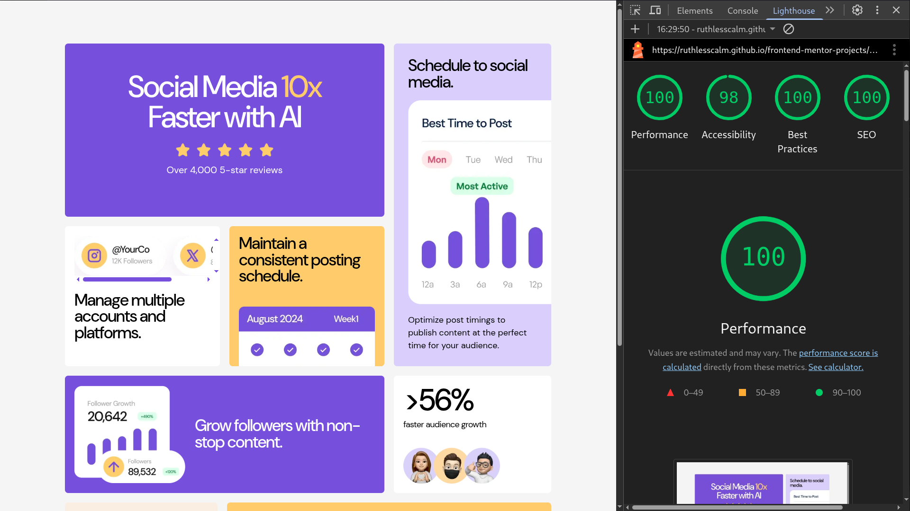

# 🚀 Frontend Mentor - Bento Grid
"Bento Grid Landing Page that tests your layout skills with CSS Grid and Flexbox"

This is a solution to the [Bento Grid challenge on Frontend Mentor](https://www.frontendmentor.io/challenges/bento-grid-RMydElrlOj).

## 🔗 Links 
- Solution URL: [Frontend Mentor](https://www.frontendmentor.io/solutions/-pixel-perfect-fluid-bento-grid-and-398400-accessibility-VvP0mgxd0w)
- Live Site URL: [Bento Grid](https://ruthlesscalm.github.io/frontend-mentor-projects/bento-grid/)

## 🔍 Table of contents

- [🚀 Frontend Mentor - Bento Grid](#-frontend-mentor---bento-grid)
  - [🔗 Links](#-links)
  - [🔍 Table of contents](#-table-of-contents)
  - [📔 Overview](#-overview)
    - [🎯 The Challenge](#-the-challenge)
    - [📷 Screenshots](#-screenshots)
      - [🎬 Preview](#-preview)
      - [📊 Accessibility Report](#-accessibility-report)
  - [📦 Features](#-features)
  - [📌 Tech Stacks](#-tech-stacks)
  - [🛠️ Tools](#️-tools)
  - [📚 Credits /  References](#-credits---references)
  - [👤 Author](#-author)
  - [🤝 Contributing](#-contributing)
  - [📄 License](#-license)
    

## 📔 Overview

### 🎯 The Challenge

- Build landing page using HTML and CSS
- Should be responsive
- Ensure Strong Web Accessibility

### 📷 Screenshots

#### 🎬 Preview

- **Desktop** 

- **Tablet** 

- **Mobile** 

- **Zoom - 150%**

#### 📊 Accessibility Report

## 📦 Features

- Fully fluid and responsive layout (280px to 1920px)
- Web-accessible (focus states , semantic Html , screen reader friendly)

## 📌 Tech Stacks

- HTML 5
- CSS 3

## 🛠️ Tools

- [Google Fonts](https://fonts.google.com/?preview.text=Nature) - Fonts (CDN and ttf files)
- [Webfont](https://webfont.yabe.land/en/misc/convert-ttf-woff2/) - Conversion of variable ttf to variable woff2
- [Real Favicon Generator](https://realfavicongenerator.net) - Generate mutiple format favicons and customize site.webmanifest
- [squoosh](https://squoosh.app/) - Conversion of image files (png, jpeg, avif, webp etc)

## 📚 Credits /  References

- [Joshua Comeau](https://www.joshwcomeau.com/)
    - [Modern CSS Reset](https://www.joshwcomeau.com/css/custom-css-reset/)
- [Picallili - Andy Bell](https://piccalil.li/author/andy-bell/)
    - [Modern CSS Reset](https://piccalil.li/blog/a-more-modern-css-reset/)

## 👤 Author

- Github - [Ruthless Calm](https://github.com/ruthlesscalm)
- Frontend Mentor - [Ruthless Calm](https://www.frontendmentor.io/profile/ruthlesscalm)

## 🤝 Contributing

Pull req are welcome. For major changes, open an issue first.

## 📄 License

This project is licensed under the [MIT License](../LICENSE).  
You're free to use, modify, and distribute with credit to **Ruthless Calm**.
