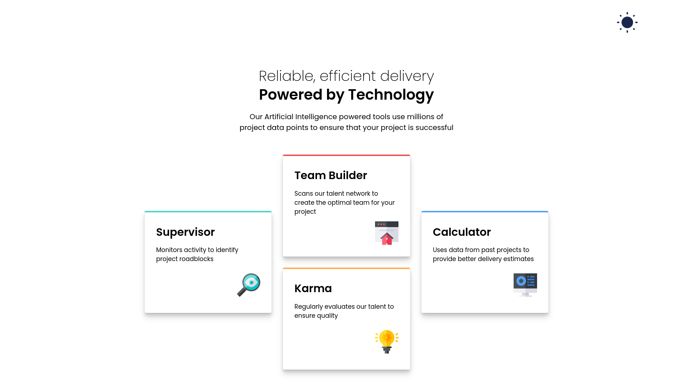
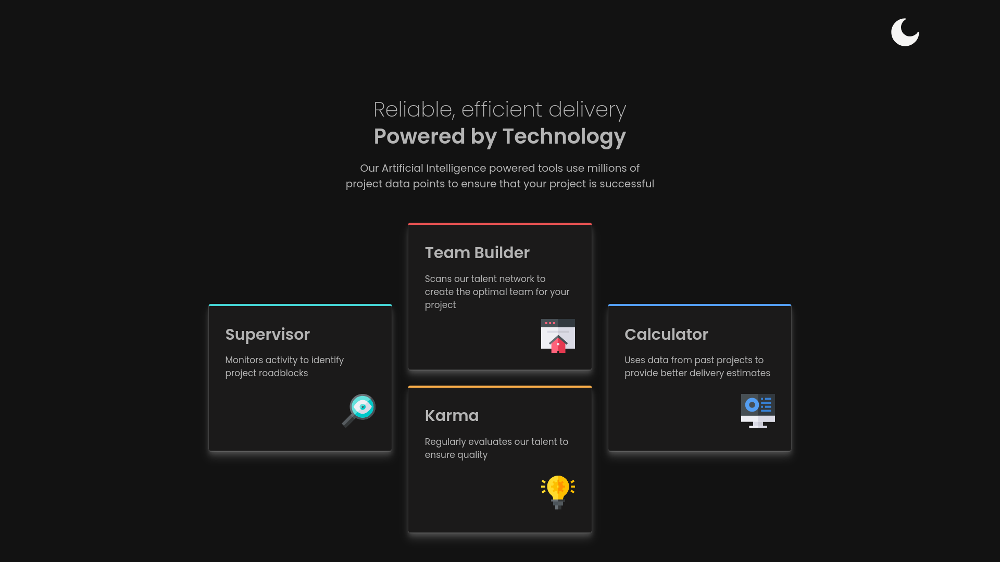
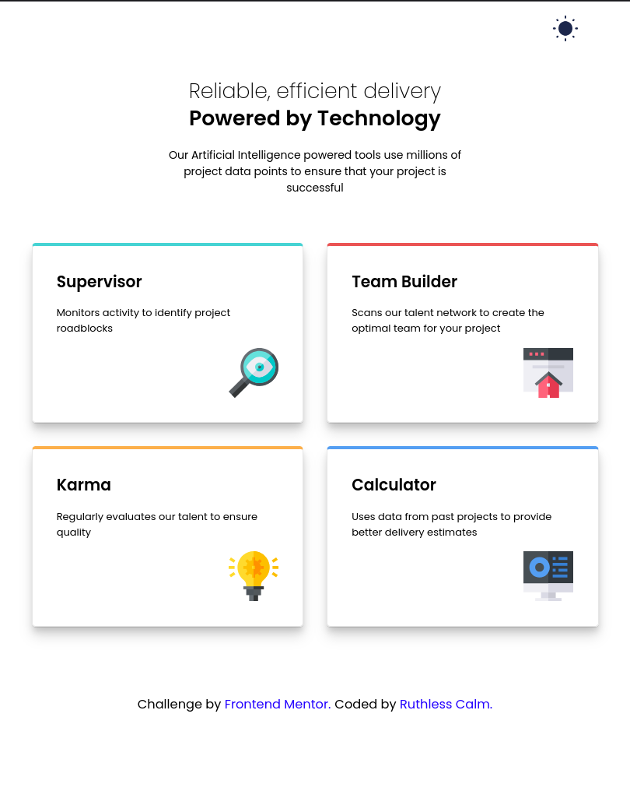
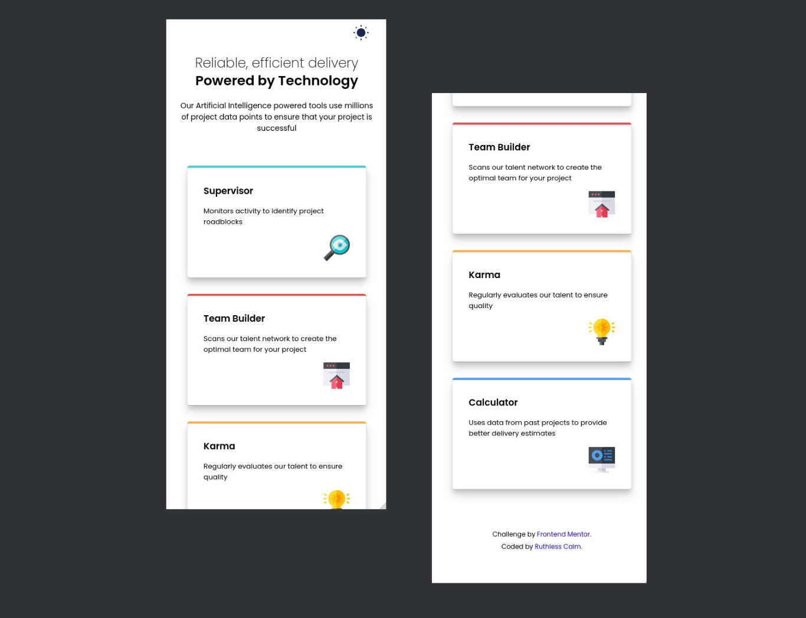
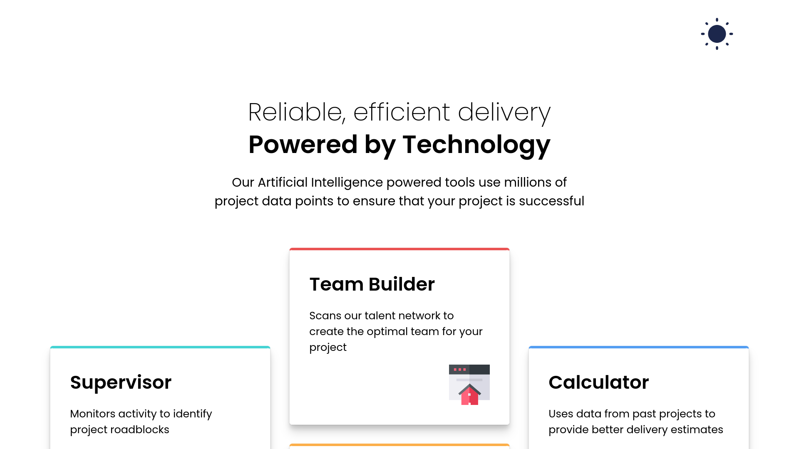
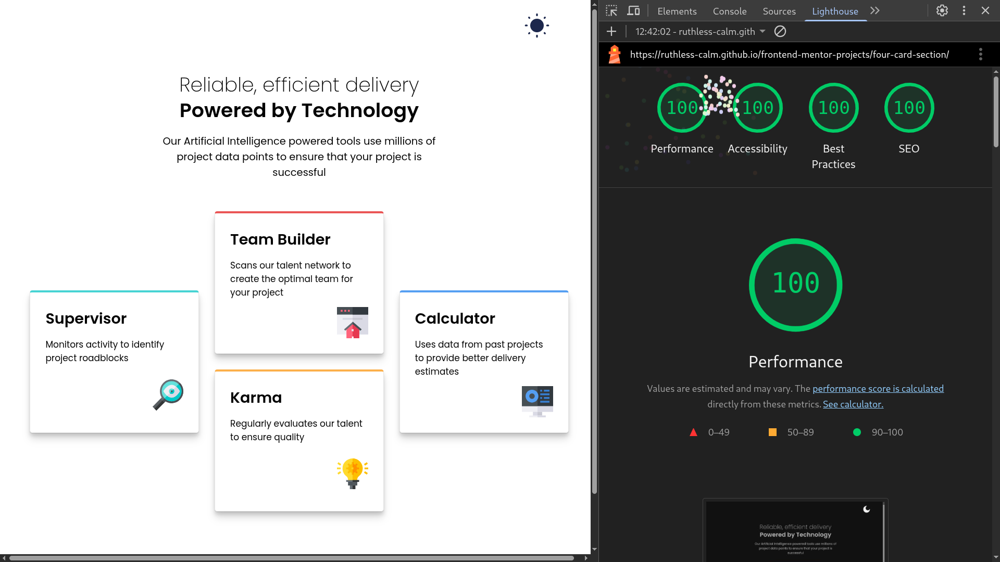

# 🚀 Frontend Mentor - Four Card Feature Section
"A sleek and modern responsive landing page built with semantic HTML and accessible, modular CSS"

This is a solution to the [Four card feature section challenge on Frontend Mentor](https://www.frontendmentor.io/challenges/four-card-feature-section-weK1eFYK).

## 🔗 Links 
- Solution URL: [Frontend Mentor]()
- Live Site URL: [Four Card Section]()

## 🔍 Table of contents

- [🚀 Frontend Mentor - Four Card Feature Section](#-frontend-mentor---four-card-feature-section)
  - [🔗 Links](#-links)
  - [🔍 Table of contents](#-table-of-contents)
  - [📔 Overview](#-overview)
    - [🎯 The Challenge](#-the-challenge)
    - [📷 Screenshots](#-screenshots)
      - [🎬 Preview](#-preview)
      - [📊 Accessibility Report](#-accessibility-report)
  - [📦 Features](#-features)
  - [📌 Tech Stacks](#-tech-stacks)
  - [🛠️ Tools](#️-tools)
  - [📚 Credits /  References](#-credits---references)
  - [👤 Author](#-author)
  - [🤝 Contributing](#-contributing)
  - [📄 License](#-license)
    

## 📔 Overview

### 🎯 The Challenge

- Build landing page using HTML and CSS
- Should be responsive
- Should be interactive ( hover states , focus states etc)
- Ensure Strong Web Accessibility
- Light/Dark mode switcher

### 📷 Screenshots

#### 🎬 Preview

- **Desktop Light** 

- **Desktop Dark** 

- **Tablet** 

- **Mobile** 

- **Zoom - 150%**

#### 📊 Accessibility Report

## 📦 Features

- Fully fluid and responsive layout (280px to 1920px)
- Custom box shadows using CSS variables
- Light/Dark mode toggle
- Web-accessible (focus states , semantic Html , screen reader friendly)

## 📌 Tech Stacks

- HTML 5
- CSS 3
- Vanilla Js

## 🛠️ Tools

- [Google Fonts](https://fonts.google.com/?preview.text=Nature) - Fonts (CDN and ttf files)
- [Transfonter](https://transfonter.org/) - Conversion of font files (ttf, woff, woff2, eot, svg) and font face generator
- [Real Favicon Generator](https://realfavicongenerator.net) - Generate mutiple format favicons and customize site.webmanifest
- [Svg Repo](https://www.svgrepo.com/) - Customisable icons in various formats and size (svg and png)
- [squoosh](https://squoosh.app/) - Conversion of image files (png, jpeg, avif, webp etc)

## 📚 Credits /  References

- [Joshua Comeau](https://www.joshwcomeau.com/)
    - [Shadow pallete](https://www.joshwcomeau.com/shadow-palette/)
    - [Box shadow techniques](https://www.joshwcomeau.com/css/designing-shadows/)
    - [Modern CSS Reset](https://www.joshwcomeau.com/css/custom-css-reset/)
- [Picallili - Andy Bell](https://piccalil.li/author/andy-bell/)
    - [Modern CSS Reset](https://piccalil.li/blog/a-more-modern-css-reset/)
- [Tobias Ahlin Bjerrome](https://tobiasahlin.com/)
    - [Box shadow techniques](https://tobiasahlin.com/blog/layered-smooth-box-shadows/)

## 👤 Author

- Github - [Ruthless Calm](https://github.com/ruthless-calm)
- Frontend Mentor - [Ruthless Calm](https://www.frontendmentor.io/profile/ruthless-calm)

## 🤝 Contributing

Pull req are welcome. For major changes, open an issue first.

## 📄 License

This project is licensed under the [MIT License](../LICENSE).  
You're free to use, modify, and distribute with credit to **Ruthless Calm**.